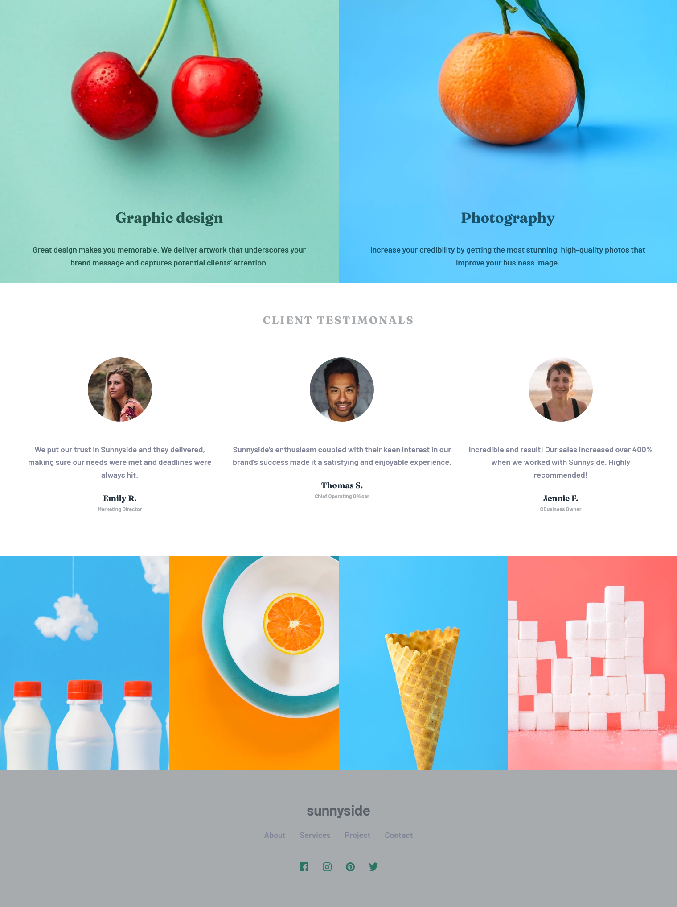

# Frontend Mentor - Sunnyside agency landing page solution

This is a solution to the [Sunnyside agency landing page challenge on Frontend Mentor](https://www.frontendmentor.io/challenges/sunnyside-agency-landing-page-7yVs3B6ef). Frontend Mentor challenges help you improve your coding skills by building realistic projects.

## Table of contents

- [Overview](#overview)
  - [The challenge](#the-challenge)
  - [Screenshot](#screenshot)
  - [Links](#links)
- [My process](#my-process)
  - [Built with](#built-with)
  - [What I learned](#what-i-learned)
  - [Continued development](#continued-development)
  - [Useful resources](#useful-resources)
- [Author](#author)

## Overview

Landing for sunnyside website which is fully responsive and designed using only pure HTML, CSS and little bit of JavaScript. CSS flexbox and media queries are main concepts, widely used in this project. Also it is hosted using vercel.

### The challenge

Users should be able to:

- View the optimal layout for the site depending on their device's screen size
- See hover states for all interactive elements on the page

### Screenshot

### Links

- Solution URL: [Add solution URL here](https://your-solution-url.com)
- Live Site URL: [Add live site URL here](https://your-live-site-url.com)

## My process

### Built with

- Semantic HTML5 markup
- CSS custom properties
- Flexbox
- DOM

### What I learned

I learn about flex-box, how to add responsive navbar/menu using JavaScript and adding transitions to html elements.

### Continued development

In future i would focusing on positioning of elements using z-index, adding new hover effects and animations.

### Useful resources

- [w3schools](https://www.example.com) - This helped me flex box.

## Author

- Website - [Suhas Kadu](https://twitter.com/suhaskadu_99/)
- Frontend Mentor - [@suhas-kadu](https://www.frontendmentor.io/profile/suhas-kadu)
- Twitter - [@suhaskadu_99](https://twitter.com/suhaskadu_99/)

